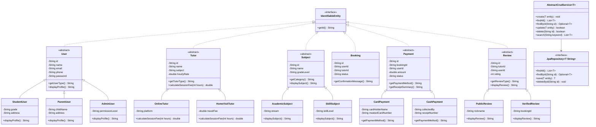

# Class Diagram

```mermaid
classDiagram
    class IdentifiableEntity {
        <<interface>>
        +getId() String
    }

    class User {
        <<abstract>>
        -String id
        -String name
        -String email
        -String phone
        -String password
        +getUserType() String
        +displayProfile() String
    }

    class StudentUser {
        -String grade
        -String address
        +displayProfile() String
    }

    class ParentUser {
        -String childName
        -String address
        +displayProfile() String
    }

    class AdminUser {
        -String permissionLevel
        +displayProfile() String
    }

    class Tutor {
        <<abstract>>
        -String id
        -String name
        -String subject
        -double hourlyRate
        +getTutorType() String
        +calculateSessionFee(int hours) double
    }

    class OnlineTutor {
        -String platform
        +calculateSessionFee(int hours) double
    }

    class HomeVisitTutor {
        -double travelFee
        +calculateSessionFee(int hours) double
    }

    class Subject {
        <<abstract>>
        -String id
        -String name
        -String gradeLevel
        +getCategory() String
        +displaySubject() String
    }

    class AcademicSubject {
        -String stream
        +displaySubject() String
    }

    class SkillSubject {
        -String skillLevel
        +displaySubject() String
    }

    class Booking {
        -String id
        -String userId
        -String tutorId
        -String status
        +getConfirmationMessage() String
    }


    class Payment {
        <<abstract>>
        -String id
        -String bookingId
        -String userId
        -double amount
        -String status
        +getPaymentMethod() String
        +getReceiptSummary() String
    }

    class CardPayment {
        -String cardHolderName
        -String maskedCardNumber
        +getPaymentMethod() String
    }

    class CashPayment {
        -String collectedBy
        -String receiptNumber
        +getPaymentMethod() String
    }

    class Review {
        <<abstract>>
        -String id
        -String tutorId
        -String userId
        -int rating
        +getReviewType() String
        +displayReview() String
    }

    class PublicReview {
        -String nickname
        +displayReview() String
    }

    class VerifiedReview {
        -String bookingId
        +displayReview() String
    }

    class JpaRepository~T String~ {
        <<interface>>
        +findAll() List~T~
        +findById(String id) Optional~T~
        +save(T entity) T
        +deleteById(String id) void
    }

    class AbstractCrudService~T~ {
        +create(T entity) void
        +findAll() List~T~
        +findById(String id) Optional~T~
        +update(T entity) boolean
        +delete(String id) boolean
        +search(String keyword) List~T~
    }

    IdentifiableEntity <|.. User
    User <|-- StudentUser
    User <|-- ParentUser
    User <|-- AdminUser

    IdentifiableEntity <|.. Tutor
    Tutor <|-- OnlineTutor
    Tutor <|-- HomeVisitTutor

    IdentifiableEntity <|.. Subject
    Subject <|-- AcademicSubject
    Subject <|-- SkillSubject

    IdentifiableEntity <|.. Booking

    IdentifiableEntity <|.. Payment
    Payment <|-- CardPayment
    Payment <|-- CashPayment

    IdentifiableEntity <|.. Review
    Review <|-- PublicReview
    Review <|-- VerifiedReview

    AbstractCrudService --> JpaRepository
```
